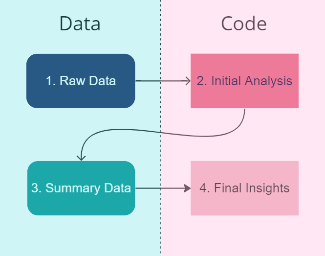

This document describes the organization of data, code files, and outputs in the Summer 2023 phase of the Air Partners HEPA air purifier pilot. The reliability and continued maintenance of this document cannot be guaranteed after August 4, 2023. The information in this document assumes reasonable familiarity with this project. For further questions regarding this document, feel free to contact [Vedaant Kuchhal](mailto:vedaantk22@gmail.com).

## Location Coding
At its very core, the location where data is collected central to categorizing the data, analyzing it, and interpreting insights. For this reason, a standard set of location codes will be used throughout this project. 

The following codes will be used to organize folders, name files, and refer to locations throughout this repository:

Roxbury:

1. CM – Cardinal Medeiros, an elderly care [? Check with team] building in Roxbury.
2. IB – Indigo Block, an affordable housing [? Check with team] building in Roxbury.
3. RH – Individual homes in Roxbury.

East Boston:

4. DC – Daycares in East Boston [ask Scott]
5. PS – Pre-schools in East Boston [ask Scott]

Revere:

6. CH – City Hall of Revere [ask Scott]
7. HS – High school in Revere [ask Scott]

HAFTRAP:

8. SC - HAFTRAP data from SCOPE project.
9. OH - Olin's HAFTRAP data.
10. TU - Tuft's HAFTRAP data [chaos TBD]

## Data Pipeline
The data pipeline for this project can be considered to be made up of four components:

Each component will have its own folder with uniquely named files. It's important to note that these folder may be nested [include final diagram of final structure of four folders once finalized].

Let's walk through each of these components:

## Raw Data
Raw data is the original, ‘on the ground’ data collected by multiple kinds of sensors as well as people. 

All files in this component is stored in the `data` folder. Crucially, *this folder is not tracked by Git*. Since committing multiple large data files would greatly slow down Git and Github and is generally considered bad practice, this folder is instead hosted on Google Drive for Air Partners 2023 in the [Data for Codebase](https://drive.google.com/drive/folders/1J6w_h6FFlxgXWv3k7CkSchYMkhryRF8n) folder. 

To get or update to the latest version of the data, navigate to the provided link and download the `data` folder inside it. The folder will be downloaded as a ZIP which should then be extracted. Move the extracted `data` folder (it should have four direct sub-folders specifying the regions) to the root folder of the `hepa-summer23` respository clone, i.e. the same location where this data guide is hosted. In case the folder name is changed during download/unzipping, rename it to `data` otherwise the file paths won't work. The folder should be untracked automatically by the `.gitignore` so modifying or replacing it shouldn't make a difference.

**To add/delete/reorganize files in this folder, always do it in the Google Drive and download to PC. Do *not* make changes your local copy of this folder. They will not be reflected anywhere else.**

This component of the pipeline contains the most files and therefore requires a clear naming system and hierarchical organization structure for best file management. As a result, this component is outlined in two parts:

1. File Categorization and Naming
2. Folder Organization Structure. 

### File Categorization and Naming
#### Sensors
The sensors deployed in various phases of this project are each coded by a single uppercase letter, and they are the following:

1. M – Modulair-PM sensors are the most common air quality monitoring device in this project. They measure concentrations of PM 1, PM 2.5, and PM 10. Installed both indoors and outdoors in Roxbury, East Boston, Revere, and the Olin-installed purifiers in the HAFTRAP study. [check with Scott + Francesca].
2. H – HOBO sensors are connected to the air purifiers and detect power usage. They enhance Modulair-PM data since they provide information about when the air purifier was switched on and its fan speed. Installed only in East Boston daycares [is this true?].
3. C – CPC sensors are very important since they detect counts of ultrafine particles (UFP). They supplement data from Modulair-PMs, which cannot detect UFPs. Installed in East Boston preschools, Revere (high school and city hall), and HAFTRAP study sites.
4. A – Modulair [to do later]
[Etc. etc.]

#### Field Notes
N – In addition to the sensor data, field notes documented by people in charge of sensor installation and air purifier deployment provide critical contextual information, such as the date the various sensors were active for and the date the air purifier was installed. Field notes should be a single file per location.

#### ID 
Each deployment has an ID number that uniquely identifies it, but (to make this project extra fun for us) different locations have different methods of identifying unique participants. The following table shows the various ID numbers used:

| Location Code      | Unique Identifier |
| ----------- | ----------- |
| CM | Apartment # |
| IB | Apartment # |
| RH | Self-Assigned Serial #    |
| DC | TBD         |
| PS | TBD         |
| CH | TBD         | 
| HS | TBD         |
| SC | Study Participant #|
| OH | Study Participant # |
| TU | TBD |

 The corresponding field notes can help make sense of the ID numbers.

#### Suffix

In addition to the IDs, the following suffixes are used:

a. `_indoor`: Indoor sensor
b. `_outdoor`: Outdoor sensor
c. `_sham`: Sham HEPA purifier deployment
d. `_hepa`: True HEPA purifier deployment

#### Naming Convention
Therefore, raw data files are labelled with the following naming convention:
`LocationCode_SensorCode_ID_suffix`

Examples:

* The csv data file for a Modulair-PM sensor in the HAFTRAP study with participant ID 41181 deployed indoors with a sham air purifier by Olin will have the file name `OH_M_41181_sham_indoor.csv`

### Folder Organization Structure
As a reminder, all raw data files are stored in a folder named `data`. Here’s a summary of the organization:

* Each subfolder is organized by general region, which is one of `Roxbury`, `EastBoston`, `Revere`, or `HAFTRAP` - the general study sites.
* Each general region subfolder is  subdivided into location folders named after the location code specified in this data guide.
*	Each location folder is further subdivided into folders by sensor type. The folders are named by a sensible lowercase abbreviation of the sensor type (e.g.- `modpm`, `hobo`, `cpc`). The only exception for this is field notes, where there is usually one file for each location and therefore the file will directly be placed in the location folder.
* Therefore, for example, the data for the indoor Mod-PM sensor for the HAFTRAP participant number 41811 whose deployment of a sham purifier was conducted by Olin can be found in `data --> Roxbury --> CM --> modpm --> OH_M_41811_sham_indoor.csv` and its relevant field notes can be found in `data --> Roxbury --> OH --> OH_N.csv`.

## Initial Analysis
This component of the pipeline concerns code files that are used to clean, filter, and summarize the raw data. They are usually in the form of various scripts in R markdown that handle multiple, complex types of raw data. Here is a description of each code file:

* `initial_data_analysis.Rmd`: Is a starter file to quickly build up working filter, cleaning, and analysis code. Kind of like a play testing war zone, ignore this file if you're trying to comprehend clean, logical code.

HAFTRAP:

* `haftrap_OH_single_summary.Rmd`: The DR1 stands for "Design Review One". It initially contained scrappily-written code for a design review with Doug Brugge, but now should have a clean pipeline to compute summary statistics from one participant's deployment with sham and true sensors.

## Summary Data
Summary data is the output of the code in Initial Analysis. It contains summary statistics, key figures, and other insights at the participant level. All summary data is stored in the `summary` folder.

Luckily for you, summary data follows the exact same organization and naming structure as Raw Data! To reference that structure, click [here](#file-categorization-and-naming).

There are two key differences with Summary Data compared to Raw Data:

1) The `summary` folder *is* tracked by Git. This is because the summary data files are much tinier than the raw data they are produced from. (E.g.- 4 MB for a raw data file, 3 KB for the equivalent summary data file)

2) While the files follow the same file naming structure, they are prepended with the suffix `s_` to distinguish them as summary data files. Additionally, a different set of suffixes is used:

* `quants` contains summary statistics such as mean, median, 5th, 25th, 75th, and 95th percentile.
* `corr` contains the correlation matrix for the dataset analyzed

Note that other [suffixes from the raw data naming](#suffix), such as `_sham`, may also be used.
