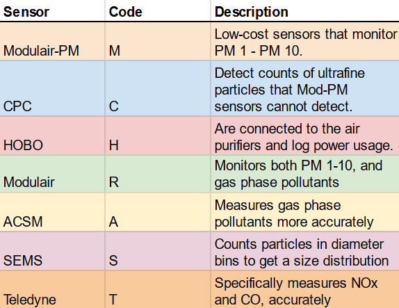

This document describes the organization of data, code files, and outputs in the Summer 2023 phase of the Air Partners HEPA air purifier pilot. The reliability and continued maintenance of this document cannot be guaranteed after August 4, 2023. The information in this document assumes reasonable familiarity with this project. For further questions regarding this document, feel free to contact [Vedaant Kuchhal](mailto:vedaantk22@gmail.com).

## Location Coding
At its core, data is categorized, analyzed, and interpreted based on the location where it is collected. This repository looks at data from four different projects around the Boston area, each with their own set of stakeholders, environmental factors, and distinct pilot locations within them. For this reason, a standard set of location codes will be used throughout this project. The following codes will be used to organize folders, name files, and refer to locations throughout this repository:

The complete table with this image (with additional details on deployments and naming) can be found [here](https://docs.google.com/spreadsheets/d/18_yT_Jh7BIjvvfufrR16GAfotsUWucHm40TVTF5LHp8/edit?usp=sharing)

## Data Pipeline
Each study region (East Boston, HAFTRAP, Revere, Roxbury) has its own history of prior Air Partners work, situational complexities, and data quality. To organize and document the various study-specific factors in a comprehensible format, we developed a broad data pipeline structure around which all data categorization and analysis is organized. 

This data pipeline has four components:

Each component will have its own folder in the root directory, named `data`, `analysis`, `summary`, and `insight` respectively.

 

If you have one takeaway from this data guide, it should be this:  **each folder representing each component of the data pipeline has the same overall structure based on location coding**.

 

Now that may not sound like much, but it means three important things:

1. The `data` folder is organized by study region, which is one of `Roxbury`, `EastBoston`, `Revere`, or `HAFTRAP` - the general study sites.
2. Each study region subfolder is  subdivided into location folders named after the [location coding specified in this data guide](#location-coding). The raw data for Cardinal Medeiros, for example, can be found in `data/Roxbury/CM`
3. **The folder structure outlined in 1. and 2. is replicated in **`summary`, `analysis`, **and ** `insight` **as well**. Each data pipeline folder has further details/complications, of course, which I will mention in the description of each component in the pipeline.

## Raw Data
Raw data is the original, ‘on the ground’ data collected by multiple kinds of sensors (or in case of field notes, people!) 

All files in this component are stored in the `data` folder. Crucially, *this folder is not tracked by Git*. Since committing multiple large data files would greatly slow down Git and is generally considered bad practice, this folder is instead hosted on Google Drive for Air Partners 2023. 

To get or update to the latest version of the data:

1. **Go to the provided [Data for Codebase](https://drive.google.com/drive/folders/1J6w_h6FFlxgXWv3k7CkSchYMkhryRF8n) Google Drive folder.**
2. Download and extract the `data` folder inside it. Deal with zipped folder(s) appropriately.
3. Move the extracted `data` folder to the root of your `hepa-summer23` respository clone, i.e. the same location as this data guide. 
4. Confirm that the folder has the expected four subfolders and is named `data`. 

The folder should be untracked automatically by the `.gitignore` so replacing it locally shouldn't make a difference on your git log.

**To add/delete/reorganize files in this folder, always do it in the Google Drive and download to PC. Do *not* modify your local copy of this folder. It will not be reflected anywhere else and result in out-of-sync versions.**

### Subfolders
Each location folder is further subdivided into folders by sensor type. The folders are named by a sensible lowercase abbreviation of the sensor type (e.g.- `modpm`, `hobo`, `cpc`). The only exception for this is [field notes](#field-notes), where the file is directly placed in relevant the location folder.

### File Naming
Data files are labelled with the following naming convention:
`LocationCode_SensorCode_ID_suffix`

You should already have looked at the [standard location codes](#location-coding). Now, let's familiarize ourselves with the sensor codes.

#### Sensor Codes
The sensors deployed in various phases of this project are each coded by a single uppercase letter:

#### Field Notes
In addition to the sensor data, field notes documented by people in charge of sensor installation and air purifier deployment provide critical contextual information, such as the date the various sensors were active for and the date the air purifier was installed. Field notes should be a single file per location, coded as `LocationCode_notes`. Some might have an additional 'reformatted' version that is a distilled, code-parseable format used by analysis code to filter data.

The following table summarizes all data naming convention:

#### Sample Explanations

* `OH_M_412711_sham_indoor.csv`: data from the Modulair-PM sensor for participant 412711 from Olin's deployments in the HAFTRAP study. The data is from a sensor installed indoors when the participant had a sham air purifier placed in their room. Found in `data/HAFTRAP/OH/modpm/`

* `CM_M_104_before_indoor.csv`: data from the Modulair-PM sensor installed indoors in apartment 104 in Cardinal Medeiros. This is before the air purifier was switched on in that home. Found in `data/Roxbury/CM/modpm/`

* `MF_notes`: field notes from the collaboration with Mother's Out Front group in East Boston. Found in `data/EastBoston/MF/`

#### The CPC Exception
There is one exception to the [data pipeline](#data-pipeline) and therefore the folder structure. You will see 'raw data' CSV files in the `cpc` folders, but in reality these files have been pre-processed from actual sensor output.

A CPC sensor outputs a new text file of data for *every day* it runs. These raw text files are stored in a subfolder of `cpc` (elegantly named `very_raw_data`). A pre-processing script found in `analysis` - location described in [analysis](#initial-analysis) - parses through the text files and outputs one CSV per participant, per environment (indoor/outdoor) which contains the **relevant variables** from the raw data. No other cleaning/filtering is done in pre-processing.

For all intents and purposes, only the correctly named CSV files found directly in the `cpc` folder will be used for all analysis. The true sensor output text files are only present for debugging and completeness in documentation.

## Initial Analysis
This component of the pipeline is the code files that are used to clean, filter, and summarize the raw data. They are usually in the form of R markdown scripts that handle multiple, complex types of raw data and output summary statistics and some plots. Each location has unique data processing needs, therefore resulting in unique sets of analysis files. The function of all analysis files are described separately for each location (you may start to notice some common patterns between locations):

### OH (Olin's deployments for HAFTRAP)
  

* `initial_data_analysis.Rmd`: Is a starter file to quickly build up working filter, cleaning, and analysis code. Kind of like a play testing war zone, ignore this file if you're trying to comprehend clean, logical code.

HAFTRAP:

* `haftrap_OH_single_summary.Rmd`: The DR1 stands for "Design Review One". It initially contained scrappily-written code for a design review with Doug Brugge, but now should have a clean pipeline to compute summary statistics from one participant's deployment with sham and true sensors.

## Summary Data
Summary data is the output of the code in Initial Analysis. It contains summary statistics, key figures, and other insights at the participant level. All summary data is stored in the `summary` folder.

As a reminder, summary data follows the exact same organization and naming structure as Raw Data! To reference that structure, click [here](#file-categorization-and-naming).

There are two key differences with Summary Data compared to Raw Data:

1) The `summary` folder *is* tracked by Git. This is because the summary data files are much tinier than the raw data they are produced from. (E.g.- OH raw data is ~2.8 GB, OH summary data is ~580 KB)

2) While the files follow the same file naming structure, they are prepended with the prefix `s_` to distinguish them as summary data files. Additionally, a different set of suffixes is used:

* `quants` contains summary statistics such as mean, median, 5th, 25th, 75th, and 95th percentile.
* `corr` contains the correlation matrix for the dataset analyzed

Note that other [suffixes from the raw data naming](#suffix), such as `_sham`, may also be used.
