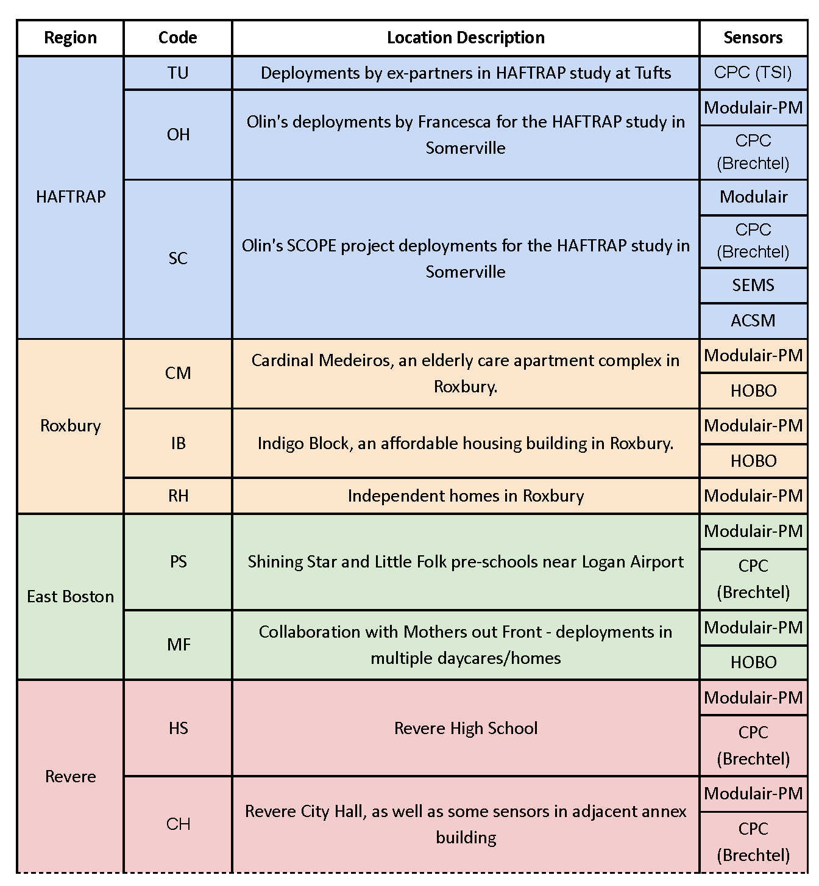

This document describes the organization of data, code files, and outputs in the Summer 2023 phase of the Air Partners HEPA air purifier pilot. The reliability and continued maintenance of this document cannot be guaranteed after August 4, 2023. The information in this document assumes reasonable familiarity with this project. For further questions regarding this document, feel free to contact [Vedaant Kuchhal](mailto:vedaantk22@gmail.com).

## Location Coding
At its core, data is categorized, analyzed, and interpreted based on the location where it is collected. This repository looks at data from four different projects around the Boston area, each with their own set of stakeholders, environmental factors, and distinct pilot locations within them. For this reason, a standard set of location codes will be used throughout this project. The following codes will be used to organize folders, name files, and refer to locations throughout this repository:

The complete table with this image (with additional details on deployments and naming) can be found [here](https://docs.google.com/spreadsheets/d/18_yT_Jh7BIjvvfufrR16GAfotsUWucHm40TVTF5LHp8/edit?usp=sharing)

## Data Pipeline
Each study region (East Boston, HAFTRAP, Revere, Roxbury) has its own history of prior Air Partners work, situational complexities, and data quality. To organize and document the various study-specific factors in a comprehensible format, we developed a broad data pipeline structure around which all the projects regarding HEPA air purifier pilots are organized. 

This data pipeline has six components:

Each component will have its own folder in the root directory, named `data`,`cleaning`, `analysis`, `summary`, `insight`, and `artifacts` respectively.

 

If you have one takeaway from this data guide, it should be this:  **all locations follow the same data pipeline structure, which means that each folder in the pipeline contains the same set of location folders**.

 

Confusing? Here's an example of where the pipeline is housed for Olin's HAFTRAP deployments (OH):

As you can see, the location folders follow the same structure outlined in the [above table](#location-coding).

To keep things nice and standardized, there are common conventions and organization structures for each component of the pipeline, even between different locations. 

Each location has its own data guide with the specifics for the files and instructions for running the pipeline for that particular location. The location-specific data guides are linked at the end of this file. *Please read this data guide first as it provides an important overview of each of the six components.*

## Raw Data (`data`)
**This component has by far the most files, and it is the largest and most important of the six components to read to understand how files are organized and new files can be added.**

Raw data is the original, ‘on the ground’ data collected by multiple kinds of sensors (or in case of field notes, people!) 

All files in this component are stored in the `data` folder. Crucially, *this folder is not tracked by Git*. Since committing multiple large data files would greatly slow down Git and is generally considered bad practice, this folder is instead hosted on Google Drive for Air Partners 2023. 

To get or update to the latest version of the data:

1. **Go to the provided [Data for Codebase](https://drive.google.com/drive/folders/1J6w_h6FFlxgXWv3k7CkSchYMkhryRF8n) Google Drive folder.**
2. Download and extract the `data` folder inside it. Deal with zipped folder(s) appropriately.
3. Move the extracted `data` folder to the root of your `hepa-summer23` respository clone, i.e. the same location as this data guide. 
4. Confirm that the folder has the expected four subfolders and is named `data`. 

The folder should be untracked automatically by the `.gitignore` so replacing it locally shouldn't make a difference on your git log.

**To add/delete/reorganize files in this folder, always do it in the Google Drive and download to PC. Do *not* modify your local copy of this folder. It will not be reflected anywhere else and result in out-of-sync versions.**

### Subfolders
Each location folder is further subdivided into folders by sensor type. The folders are named by a sensible lowercase abbreviation of the sensor type (e.g.- `modpm`, `hobo`, `cpc`). The only exception for this is [field notes](#field-notes), where the file is directly placed in relevant the location folder.

### File Naming
Data files are labelled with the following naming convention:
`LocationCode_SensorCode_ID_suffix`

**When adding a new file to the dataset, name it appropriately according to convention**.

You should already have looked at the [standard location codes](#location-coding). Now, let's familiarize ourselves with the sensor codes.

#### Sensor Codes
The sensors deployed in various phases of this project are each coded by a single uppercase letter:

In case the data is merged between different sensors, all relevant sensor codes are used (e.g.- `MC` for a file that contains Mod-PM + CPC data).

#### Field Notes
In addition to the sensor data, field notes documented by people in charge of sensor installation and air purifier deployment provide critical contextual information, such as the date the various sensors were active for and the date the air purifier was installed. Field notes should be a single file per location, coded as `LocationCode_notes`. Some might have an additional 'reformatted' version that is a distilled, code-parseable format code in `analysis` to filter data.

#### Sample Explanations

* `OH_M_412711_sham_indoor.csv`: data from the Modulair-PM sensor for participant 412711 from Olin's deployments in the HAFTRAP study. The data is from a sensor installed indoors when the participant had a sham air purifier placed in their room. Found in `data/HAFTRAP/OH/modpm/`

* `CM_M_104_before_indoor.csv`: data from the Modulair-PM sensor installed indoors in apartment 104 in Cardinal Medeiros. This is before the air purifier was switched on in that home. Found in `data/Roxbury/CM/modpm/`

* `MF_notes`: field notes from the collaboration with Mother's Out Front group in East Boston. Found in `data/EastBoston/MF/`

## Cleaning (`cleaning`)
This component is pretty self-explanatory. Implementations vary, but the overall aims are the same:

1. Ingest raw data files
2. Select and/or compute the relevant columns
3. Filter out incorrect readings
4. Deal with date-times (trust me this is big)
5. Add grouping variables (e.g. - before vs. after) based on time
6. Calculate indoor/outdoor ratios if relevant

The output should be a set of cleaned, usually [tidy](https://tidyr.tidyverse.org/articles/tidy-data.html) dataframes that contains all the variables required for further analysis. These aren't saved as CSV files but as `.RData` dataframes **untracked by git** (again, since the file sizes are large). Typically, there should be one dataframe containing data for all participants for one sensor type (e.g.- Mod-PM, or CPC).

## Initial Analysis (`analysis`)
The analysis component can contain many code files, but it uses the cleaned data to do essentially two broad things:

1. Calculate summary statistics of the data to use for further analysis
2. Plot various graphs of the data to analyse patterns and derive findings

Summary statistics include values such as the mean, median, and 5th, 25th, 75th, and 95th percentiles. Additionally, percentage reductions in these values (from with the HEPA purifier to without) are also calculated. Aside from this, correlation coefficients between variables may also be computed to determine agreement between different sensor measurements. All calculations are done by participant as well as over all the data. Output from this section is stored in `summary` (described soon).

The plotting part of the pipeline can include many kinds of plots depending on the project's analysis needs. These could range from boxplots to diurnal plots, and much more. Importantly, plots generated in this component are saved into the corresponding folder in the `artifacts` component.

Each location has unique data processing needs, and therefore,a unique set of analysis files. As with all other components, the analysis files are described separately for each location (you may start to notice some common patterns between locations).

## Summary Data (`summary`)
Summary data is the output of the code in `analysis`. It contains summary statistics, any other overall values relevant to the given analysis (e.g.- correlation coefficients).

Summary data follows the [same naming convention as Raw Data](#file-naming)!

There are two key differences with Summary Data compared to Raw Data:

1) The `summary` folder *is* tracked by Git. This is because the summary data files are much tinier than the raw data they are produced from. (E.g.- OH raw data is ~2.8 GB, OH summary data is ~580 KB)

2) While the files follow the same file naming structure, they are prepended with the prefix `s_` to distinguish them as summary data files. Additionally, since the data is summarized (no longer separate files for indoor/outdoor, for example), a different set of suffixes are used. Once again, specifics depend on the location, but here are some examples:

* `quants` contains summary statistics such as mean, median, 5th, 25th, 75th, and 95th percentile.
* `corr` contains the correlation matrix for the dataset analyzed

Additionally, summary data may also contain temporary `.RData` dataframes *untracked by Git* that are used in supporting final calculations in `insight`. Once again, these too depend on the analysis needs of the specific location.

## Final Insights (`insight`)
By this component, the data has been analysed and summarized to a point where only 1-2 files are needed to deep dive into collecting and confirming any insights that may have arisen from the output of `analysis`. The code in this component will used the data from `summary` to generate some final graphs and/or tables which succinctly show the key insights from this dataset. Importantly, the output from this section will also be stored in `artifacts`.

## Artifacts (`artifacts`)
This folder is essentially a dump of the outputs from the `analysis` and `insight` components and completely dependens on the location, but there are two things to keep in mind:

1. The entire folder is *untracked by git*. There is no copy on an external drive, so to get the code output artifacts you'll need to, well, run the code.
2. The folder will be organized into reasonably named subfolders (e.g. - the diurnal plots go into a folder named `diurnals`). The assumption is that by the time you are dealing with this folder, you already have a good enough understanding of the code and its outputs.
