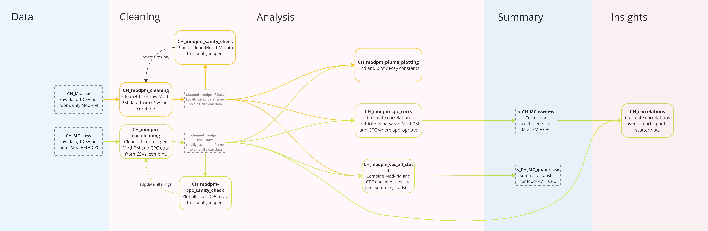

This document describes the organization of data, code files, and outputs for the Revere City Hall HEPA Air Purifier pilot. **If you haven't already, read the [main data guide](../data_guide.html) to understand the overall pipeline structure** (this link may only work if opened in browser).

The reliability and continued maintenance of this document cannot be guaranteed after July 26, 2024. The information in this document assumes reasonable familiarity with this project. For further questions regarding this document, feel free to contact [Vedaant Kuchhal](mailto:vedaantk22@gmail.com).

## Overview
The deployments here were in various rooms at the Revere City Hall and a nearby municipal building. Outdoor sensors were installed as well right outside these buildings. There were a mix of some deployments with only Mod-PM and others with both Mod-PM and CPC sensors.

* The participants are coded by their room name
* The monitoring was done for an "off" period with no air purifier, followed by an "on" period with a running air purifier.

*All* files that are associated with Revere City Hall should have `CH_` prefixed to their name.

**Fun fact:** The Revere City Hall (`CH`), Revere High School (`RH`), East Boston Little Folks (`LF`) and Shining Star (`SS`) preschools all have the same data format and therefore the same cleaning, analysis, etc. structure. Reading this guide should set you up for understanding all the other three!

## Pre-requisites
To run the code in `cleaning`, `analysis`, and `insight`, only the `tidyverse` collection of packages needs to be installed into RStudio

This guide also assumes access to the appropriate folders from the Air Partners Google Drive, especially [the one with the data](https://drive.google.com/drive/u/0/folders/1KEAv7w8r2XXhcmSFqohsCHd2VaLua97b)

## Data Pipeline
Unlike the main data guide, this description of the pipeline focuses on *understanding the files and getting the code to run*. Before we dive in, look at the following figure that outlines all the files:

Click [here](https://github.com/airpartners/hepa-summer23/blob/main/.img/.CH_files.jpg) to see an isolated version you can zoom into.

## Raw Data (`data`)
If you have just freshly cloned the repository, you won't (or definitely shouldn't) actually have this folder. Reminder that *this folder is not tracked by Git*.

Get the data (copied over from the main data guide):

1. **Go to the provided [Data for Codebase](https://drive.google.com/drive/u/0/folders/1KEAv7w8r2XXhcmSFqohsCHd2VaLua97b) Google Drive folder.**
2. Download and extract the `data` folder inside it. Deal with zipped folder(s) appropriately.
3. Move the extracted `data` folder to the root of your `hepa-summer23` respository clone, i.e. the same location as this data guide. 
4. Confirm that the folder has the expected four subfolders and is named `data`. 

The folder should be untracked automatically by the `.gitignore` so replacing it locally shouldn't make a difference on your git log.

**To add/delete/reorganize files in this folder, always do it in the Google Drive and download to PC. Do *not* modify your local copy of this folder. It will not be reflected anywhere else and result in out-of-sync versions.**

### Subfolders
`data/Revere/CH` has two folders and one Excel file:

* `modpm/` storing data from deployments with only Mod-PM data
* `modpm-cpc/` storing data from deployments with Mod-PM and CPC data
* `CH_notes.xlsx` contains field notes for Revere City Hall

The standard naming convention is followed, namely `CH_SensorCode_RoomName`. Sensor code for Revere City Hall is either `M` (Mod-PM) or `MC` (Mod-PM+CPC). Room names are literal (e.g. `clerk`, `mainroom`) and can be referred to in the field notes.

Each data file contains all cleaned, merged data (including indoor, outdoor, purifier off and on, and all pollutants measured). Consider yourself lucky!

## Cleaning (`cleaning`)
All scripts in `cleaning/Revere/CH` are R Markdown (`.Rmd`) files, run through RStudio. Quick overview of the scripts:

* `CH_modpm_cleaning.Rmd`: Cleans and combines files with only Mod-PM data, outputs combined single dataframe `cleaned_modpm.RData`
* `CH_modpm_sanity_check.Rmd`: Plots time-series of Mod-PM data to check correctness of cleaning script.
* `CH_modpm-cpc_cleaning.Rmd`, and `CH_modpm-cpc_sanity_check.Rmd` do the same for files with both Mod-PM and CPC data.

## Initial Analysis (`analysis`)
It's finally analysis time! Here are the 3 analysis scripts for the two cleaned dataframes:

* `CH_modpm-cpc_all_stats.Rmd`: Generates summary statistics for all deployments in `CH`
* `CH_modpm_cpc_corrs.Rmd`: Computes correlation coefficients between Mod-PM and CPC data
* `CH_modpm_plume_plotting.Rmd`: Calculates the decay constants for the peaks in the indoor data for Mod-PM sensors

## Summary Data (`summary`)
Two summary data files, both tracked by Git, are generated by the analysis scripts.

### Summary Statistics
* `s_CH_MC_quants.csv` contains summary statistics for all the deployments for all the variables, both by deployment and overall
* `s_CH_MC_corr.csv` contains the correlation coefficients for all relevant variable pairs, only for the deployments where both Mod-PM and CPC data are present. 

## Final Insights (`insight`)
The single file in this folder, `CH_correlations.Rmd`, is essentially a deep dive extension of `CH_modpm-cpc_corrs.Rmd` and specifically investigates the correlation between readings from the CPC sensor and the Mod-PM sensor. This script has some scary-looking plotting functions and multiple (albeit very insightful) things going on, but in essence it plots CPC counts against PM measurements to provide a more nuanced analysis of the correlation coefficients. Like much else in this guide, a significantly more detailed explanation is provided for similar scripts in `OH_data_guide.md`. 

---

## Conclusion
Congratulations!! You made it! Now look at the same figure shown at the start of the guide.

Click [here](https://github.com/airpartners/hepa-summer23/blob/main/.img/.OH_files.jpg) to see an isolated version you can zoom into.

Does it make more sense now?

Thank you for reading and have a nice day!
