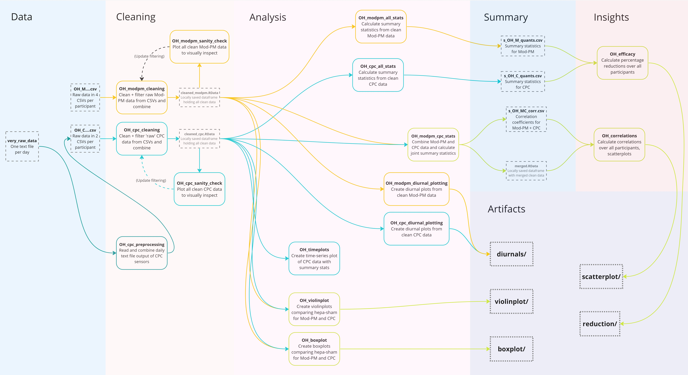
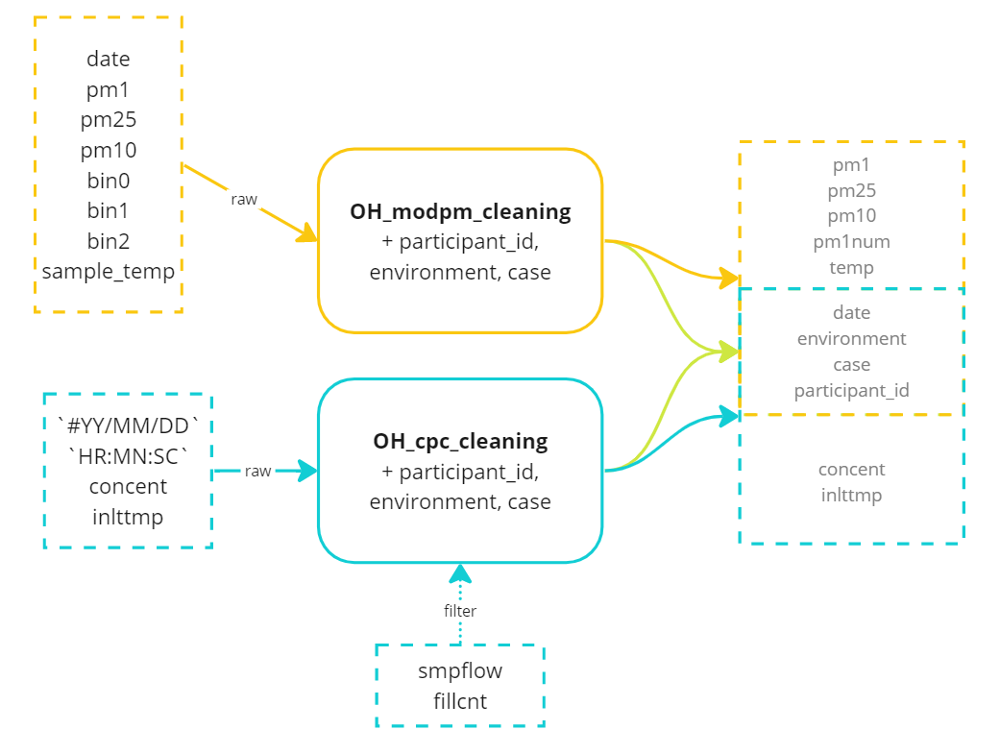

This document describes the organization of data, code files, and outputs in the Summer 2023 phase of analyzing Olin's HAFTRAP deployments by Sanju Jatti and Vedaant Kuchhal. **If you haven't already, read the [main data guide](../data_guide.html) to understand the overall pipeline structure** (this link may only work if opened in browser).

The reliability and continued maintenance of this document cannot be guaranteed after August 4, 2023. The information in this document assumes reasonable familiarity with this project. For further questions regarding this document, feel free to contact [Vedaant Kuchhal](mailto:vedaantk22@gmail.com).

I suppose it is worth saying - this document is long and packed with tons of important information where every detail counts, so don't try to read this in one sitting! Take breaks, run code and understand as you go, and remember that you are ultimately processing 10 weeks of full-time work by two people.

## Overview
The Olin HAFTRAP deployments are part of the HAFTRAP study focusing on participants living along the highway I-93 in Somerville. The study is conducted in a clinical trial format, which means the following things for the air quality data:

* The participants are coded by anonymized participant IDs
* The air purifier was deployed in two one-week segments. In one week, the participants got a purifier without a filter that did not do anything (`sham`), whereas the other, they got a working HEPA air purifier (`hepa`).
* For each participant, there was one set of sensors sampling indoors, and an equivalent set sampling outdoors.
* For Olin HAFTRAP in particular, two types of sensors were deployed: low-cost Modulair- PM (Mod-PM) sensors measuring particles between 0.35-10 microns, and more expensive Condensation Particle Counter (CPC) sensors measuring ultrafine particles (UFPs) less than 0.35 microns in diameter.

*All* files that are associated with Olin HAFTRAP should have `OH_` prefixed to their name.

## Pre-requisites
To run the code in `cleaning`, `analysis`, and `insight`, three things are required:

1. Install R and RStudio
2. Set up Github and clone [this project's repository](https://github.com/airpartners/hepa-summer23/)
3. Install the following packages into RStudio: `tidyverse`, `readxl`,`data.table`, `scales`, `corrr`, `pracma`, `forecastML`, `zoom`.

Optionally, it will make life vastly easier for you if you can get [Github working through RStudio](https://happygitwithr.com/rstudio-git-github.html).

This guide also assumes access to the appropriate folders from the Air Partners Google Drive, and if you want to download and add new data from Mod-PM sensors (described soon) you will also need to be set up appropriately with QuantAQ.

## Data Pipeline
Unlike the main data guide, this description of the pipeline focuses on *understanding the files and getting the code to run*. Before we dive in, look at the following figure that outlines all the files (except the decay analysis files - added last-minute) in the entire pipeline:

Click [here](https://github.com/airpartners/hepa-summer23/blob/main/.img/.OH_files.jpg) to see an isolated version you can zoom into.

If this is more than a bit overwhelming to look at, you're not alone! Hopefully, by the end of this data guide, that figure won't be as scary to look at. Let's get into it.

## Raw Data (`data`)
If you have just freshly cloned the repository, you won't (or definitely shouldn't) actually have this folder. Reminder that *this folder is not tracked by Git*.

Copied over from the main data guide, to get or update to the latest version of the data:

1. **Go to the provided [Data for Codebase](https://drive.google.com/drive/u/0/folders/1KEAv7w8r2XXhcmSFqohsCHd2VaLua97b) Google Drive folder.**
2. Download and extract the `data` folder inside it. Deal with zipped folder(s) appropriately.
3. Move the extracted `data` folder to the root of your `hepa-summer23` respository clone, i.e. the same location as this data guide. 
4. Confirm that the folder has the expected four subfolders and is named `data`. 

The folder should be untracked automatically by the `.gitignore` so replacing it locally shouldn't make a difference on your git log.

**To add/delete/reorganize files in this folder, always do it in the Google Drive and download to PC. Do *not* modify your local copy of this folder. It will not be reflected anywhere else and result in out-of-sync versions.**

Notes:

* The folder may download as two (or more zipped files). In this annoying situation, unzip the bigger one first and manually copy over the files from the second one into their respective folders and subfolders.
* Download the entire folder, *don't try to download just the HAFTRAP data*. This is required for all the file paths to work out.
* Ensure that the `data` folder is in the root directory (`hepa-summer23`) and that it contains the four region folders - *not* a nested `data` folder which can happen if not unzipped correctly.

### Subfolders
In `data/HAFTRAP/OH` you will find two folders and three Excel files:

* `modpm/` storing Mod-PM data
* `cpc/` storing CPC data
* `OH_notes.xlsx` contains field notes for Olin HAFTRAP
* `OH_notes_summarized.xlsx` contains the same notes but code-parseable
* `OH_participants.xlsx` contains a list of participant IDs corresponding to each sensor.

When adding a new participant to the dataset, remember to (1) Update the field notes (including summarized ones) and (2) Update the participant ID lists appropriately.

### Mod-PM Data (`modpm/`)
This folder contains CSV files containing data from Mod-PM sensors downloaded from QuantAQ's website. Files have the naming convention
`OH_M_ParticipantID_case_environment` where:

* `OH_M` is fixed and indicates Mod-PM data for Olin HAFTRAP
* `ParticipantID` is assigned in the study, e.g. - `41181`
* `case` tells us whether the HEPA air purifier had a filter in that dataset. Either `sham` (no) or `hepa` (yes).
* `environment` tells us whether the data was from a sensor installed `indoor` or `outdoor`

#### Adding New Data
Say you want to add the data to this dataset for the indoor Mod-PM sensor for participant 41271 when their Air Purifier is running. How would you do that?

1) Look at the field notes in `OH_notes`. For that participant in the `hepa` period, find the sensor ID and relevant date range.
2) Go to the QuantAQ website and download the data for the sensor in that date range. Make sure you select "Raw + Final".
3) Rename the file to `OH_M_41271_hepa_indoor.csv`.
4) Move the file to `data/HAFTRAP/OH/modpm/`
5) **Upload newly generated CSV file to the corresponding Google Drive folder** 

IMPORTANT: When you download files for a participant, download the complete set of four files (`indoor` and `outdoor`, `sham` and `hepa`) - otherwise the cleaning scripts might break and you won't be getting useful information from an incomplete set anymore.

6) There's a hidden step once you download the complete dataset - update `OH_notes_summarized.xlsx` and `OH_participants.xlsx` appropriately. However, this is an un-ironed-out part of the process since the files **must** be updated in the Google Drive folder too. Either update both copies (local and online) or ideally, only download `data` after deciding on new participants and updating the online copies first.

### CPC Data (`cpc/`)
There is one exception to the general flow of the [data pipeline](#data-pipeline). You will see 'raw data' CSV files in this folder, but in reality these files have been pre-processed from actual sensor output.

A CPC sensor outputs a new text file of data for *every day* it runs. These raw text files are stored in a subfolder (elegantly named `very_raw_data/`). A pre-processing script found in `cleaning` - parses through the text files and outputs one CSV per participant, per environment (`indoor`/`outdoor`) which contains the **relevant variables** from the raw data. No other cleaning/filtering is done in pre-processing.

For all intents and purposes, only the correctly named CSV files found directly in the `cpc` folder will be used for all analysis. 

#### Adding New Data
However, when data from a new sensor is being added, you will need to re-run the pre-processing script. Say you want to add the data to this dataset for the outdoor CPC sensor for participant 45451 when their Air Purifier is *not* running. How would you do that?

1) Upload the data into the relevant folders in **Google Drive**.
2) Update the `OH_participants`, `OH_notes_summarized` sheets online as described for Mod-PM.
3) Re-download the entire data folder (sorry, there isn't a cleaner way of doing this yet)
4) Add the CPC text files to the relevant folders within `data/HAFTRAP/OH/cpc/very_raw_data`.
5) Run `cleaning/HAFTRAP/OH/OH_cpc_preprocessing.Rmd` (covered in the [cleaning](#cleaning) section)
6) **Upload newly generated "raw" CSV file to the corresponding Google Drive folder**

Once again, try to get a complete set of data which for CPC is `indoor` and `outdoor` - the CPC files have the naming convention `OH_C_ParticipantID_environment`. Notably, (by nature of the pre-processing script) each file contains both `sham` and `hepa` data. The case (`sham`/`hepa`) is added in `cleaning`.

## Cleaning (`cleaning`)
All scripts in `cleaning/HAFTRAP/OH` are R Markdown (`.Rmd`) files, run through RStudio. Quick overview of the scripts:

1) `OH_modpm_cleaning.Rmd`: Cleans raw Mod-PM data, outputs combined single dataframe `cleaned_modpm.RData`
2) `OH_cpc_cleaning.Rmd`: Same for CPC data, outputs `cleaned_cpc.RData`.
3) `OH_modpm_sanity_check.Rmd`: Plots time-series of Mod-PM data for chosen participant to see if cleaning worked correctly.
4) `OH_cpc_sanity_check.Rmd`: Same for CPC data all participants
5) `OH_cpc_preprocessing.Rmd`: Combines CPC data from daily text files into two CSV files per participant.

**The key takeaway from this component is understanding what the cleaned data looks like, since this data format is standardized, [tidy](https://tidyr.tidyverse.org/articles/tidy-data.html), and is used for all analysis going forward.**

The raw data has many columns, but those are either dropped, used to filter data, or combined to form the final columns (columns and variables are, by definition, equivalent in tidy data):

Both the output dataframes `cleaned_modpm.RData` and `cleaned_cpc.RData` contain the following columns:

* `date` (\<dttm\>): The date and time of measurement
*  `participant_id` (\<chr\>): 5-digit HAFTRAP Participant ID
*  `environment` (\<chr\>): Either `indoor`, `outdoor`, or `ratio` (which is `indoor`/`outdoor`)
* `case` (\<chr\>): Either `sham` or `hepa`

These four variables, together, specify one observation (e.g.- the reading at 14:24:00 on 2022/10/23 for the indoor sensor for participant 45361 when their air purifier didn't have a filter).

`cleaned_modpm.RData` also contains the following columns:

* `pm1` (\<dbl\>): The PM 1 Concentration (micrograms per cubic meter)
* `pm25` (\<dbl\>): The PM 2.5 Concentration (micrograms per cubic meter)
* `pm10` (\<dbl\>): The PM 10 Concentration (micrograms per cubic meter)
* `pm1num` (\<dbl\>): The PM 1 Particle Count (per cubic meter)
* `temp` (\<dbl\>): Temperature of the air sample entering the sensor (degrees Celsius)

`cleaned_cpc.RData`, alternatively, also contains the following columns:

* `concent` (\<dbl\>): The ultrafine particle (UFP) count (particles per cubic meter)
* `inlttmp` (\<dbl\>): Air temperature at the inlet of the sensor (degrees Celsius)

Note that for their respective datasets, the cleaning scripts compute the Indoor/Outdoor ratio averaged over ten minutes. Additionally, `OH_cpc_cleaning.Rmd` reads deployment data from `OH_notes_summarized.xlsx` to add the case (`sham` or `hepa`) based on time-filtering.

That's *all* the variables used in *all* further analysis from this point!

#### Obtaining Existing Data
Once again, `cleaned_modpm.RData` and `cleaned_cpc.RData` are untracked by Git, which means that they won't be automatically present in your clone of the repository. *You will need to run the cleaning code at least once to get clean data.* This assumes that you have the `data` folder downloaded and in the right place:

* Open `OH_modpm_cleaning.Rmd` and click "Run All"
* Open `OH_cpc_cleaning.Rmd` and click "Run All"

#### Adding New Data
Did the wonky 6-step processes in [Raw Data](#raw-data-data) scare you away? Do not worry, adding new data to the cleaned dataframes in this step (*after* you have completed the corresponding steps in Raw Data) is simple:

1. Run the relevant cleaning script (depending on whether the new data is Mod-PM or CPC) as described above
2. Run the relevant sanity checking script to quickly visually inspect time-series data for any values that seem anomalous.
3. In the rare case that the new data looks like it needs to be filtered, update the relevant cleaning script
4. (Repeat steps (2) and (3) until you're happy)

## Initial Analysis (`analysis`)
If the past two rather dull sections on data organization and cleaning have made you want to give up data science altogether, cheer up because it's finally analysis time! Here are the 8 exciting scripts all doing cool things with the two cleaned dataframes:

* `OH_modpm_all_stats.Rmd`: Generates summary statistics for Mod-PM data
* `OH_cpc_all_stats.Rmd`: Generates summary statistics for CPC data
* `OH_modpm_cpc_corrs.Rmd`: Computes correlation coefficients between particle measurement variables in both Mod-PM and CPC data
* `OH_boxplot.Rmd`: Generates boxplots of the overall distribution of data between different cases
* `OH_violinplot.Rmd`: Generates violinplots of the overall distribution of data between different cases
* `OH_timeplots.Rmd`: Quick script to generate time-series plots for a single participant with some summary statistics overlaid
* `OH_modpm_diurnal_plotting.Rmd`: Generates diurnal plots for the different particle measurements for Mod-PM sensors.
* `OH_cpc_diurnal_plotting.Rmd`: Generates diurnal plots for the UFP Count for CPC sensors.
* `OH_modpm_decay_analysis.Rmd`: Calculates the decay constants for the peaks in the indoor data for Mod-PM sensors
* `OH_cpc_decay_analysis.Rmd`: Calculates the decay constants for the peaks in the indoor data for CPC sensors

Adding new data to any plot or table (assuming all previous steps have been followed correctly) is simply a matter of re-running the relevant script! Let's dive into a little more detail into the scripts, generally categorizing the scripts based on whether they are used for summarizing or plotting.

### Summarizing
Three scripts in `analysis/HAFTRAP/OH` are used to generate new tables of summary data. All these tables are stored in `summary` and the data format and significance will be described in the Summary Data section. Here's a quick overview:

1) `OH_modpm_all_stats.Rmd` and `OH_cpc_all_stats.Rmd` both do the same calculations, except that one does it for the five measurement variables (`pm1`, `pm25`, `pm10`, `pm1num`, `temp`) in Mod-PM data and the other does it for the two variables (`concent`, `inlttmp`) in CPC data. For each of the variables, the scripts calculate the mean, median, 5th, 25th, 75th, and 95th percentiles. This is done for *each participant* **and** *overall data*. Next, the scripts calculate the percentage reduction in each of those summary statistics from `sham` to `hepa`. The resulting dataframes are stored in `summary/HAFTRAP/OH` as `s_OH_M_quants.csv` and `s_OH_C_quants.csv` respectively.

2) `OH_modpm_cpc_corrs.Rmd` calculates the Pearson's correlation coefficient between different variables for the `sham` and `hepa` cases separately. The correlation coefficients are calculated for 10 minute averages of all the variables (to allow time for mixing and therefore fair comparison). The script uses both CPC and Mod-PM data for participants specified in `OH_participants.xlsx`. It outputs a CSV file `s_OH_MC_corr.csv` which contains correlation coefficients both for each participant *and* overall. In addition, the script also outputs an untracked dataframe `merged.RData` into the `summary` folder which contains the 10-minute average of Mod-PM and CPC data time-synced and merged.

3) `OH_modpm_decay_analysis.Rmd` and `OH_cpc_decay_analysis.Rmd` both do the same calculations, except that one does it for three measurement variables (`pm1`, `pm25`, `pm10`) in Mod-PM data and the other does it for ultrafine particle count (`concent`) in CPC data. For each of the variables, the scripts find the decay constants, peak width, and peak height. This is done for *each participant* **and** *overall data*. For the decay analysis files, the method of saving data is a bit more complicated. Much of the decay analysis is a process of testing out thresholds and variables for each participant and case. Because of this, the final code to save the decay constants is commented out to start. When starting decay analysis for a new location, run the first line of code in the final section to create a new empty dataframe. Then, for each participant, after the code is tested and the peaks/valleys are visually checked, uncomment the final code section and run it. This will append it to the existing decay data. After this, the decay constants and other relevant information will be saved to a CSV in the summary folder and can be used to compute summary statistics for the decay constants. The resulting dataframes are stored in `summary/HAFTRAP/OH` as `s_OH_M_decay.csv` and `s_OH_C_decay.csv` respectively.

### Plotting
Other than `OH_timeplots.Rmd` (where output isn't saved), the output from all the plotting scripts is stored in `artifacts`. The plots are generated for the overall data for both Mod-PM and CPC including all participants for specific variables.

1) `OH_boxplot.Rmd` and `OH_violinplot.Rmd` are both used to visualize the distribution of particle count/concentration between `sham` and `hepa`. They *each* have 10 plots:

    * 5 plots for raw `pm1`, `pm25`, `pm10`, `pm1num1`, and `concent` respectively
    * Another 5 plots for the indoor/outdoor ratios of the same variables

The plots are stored in `artifacts/HAFTRAP/OH/boxplot` and `artifacts/HAFTRAP/OH/violinplot` respectively.

2) `OH_modpm_diurnal_plotting.Rmd` and `OH_cpc_diurnal_plotting.Rmd` show a representative daily trend of various summary statistics (mean, median, and range between 5th-95th and 25th-75th percentiles). They generate a *total* of 24 plots:

    * For CPC data, 6 plots are generated, one for each of `indoor`, `outdoor`, and `ratio` environments for both the `sham` and `hepa` case for UFP count (`concent`).
    * For Mod-PM data, 18 plots are generated - the same as for CPC but each for `pm1`, `pm25`, and `pm10`.

The plots are stored in `artifacts/HAFTRAP/OH/diurnals`.

3) `OH_timeplots.Rmd`: This script was quickly created to illustrate how a participant who experienced an overall increase in mean UFP count from `sham` to `hepa` still had a reduction in baseline UFP count from the air purifier. It plots time-series data for the `sham` and `hepa` period side-by-side with horizontal lines with various summary statistics. This will make more sense after reading about the interpreting summary statistics in the `summary` section.

## Summary Data (`summary`)
Summary data is the output of the code in `analysis` and contains just six files - five CSV files tracked by Github (and therefore present in your cloned repository) and one untracked `.RData` file.

### Summary Statistics
Both `s_OH_M_quants.csv` and `s_OH_C_quants.csv` contain the exact same columns.

* `type` is the only distinguishing column between the two which indicates the type of measurement in questions. As we have seen earlier, in `s_OH_M_quants.csv` this is `pm1`, `pm25`, `pm10`, `pm1num`, or `temp`, and in `s_OH_C_quants.csv` this is `concent` or `inlttmp`.
* `participant_id`, `environment`, and `case` columns represent the exact same things as they have earlier, except remember that there is now an added `redu` value for the `case` which holds the percentage *reduction* from `sham` to `hepa`.

These columns together form a single observation (e.g. - the percentage reduction in indoor PM 10 Concentration for participant 41811) while the remaining columns contain values of various summary statistics.

* `mean` contains - you guessed it - the mean of the given value. While the most obvious, it's just *one* indicator of exposure to air particles. One of its main disadvantages is that it is heavily skewed by peaks which, indoors, are often independent of outdoor pollution levels.
* `median` provides an alternative measure of average. As the 50th percentile, this more accurately represents a 'typical' exposure to particles and isn't skewed by peaks.
* `q5` and `q25` are the 5th and 25th percentiles respectively. They represent the 'baseline' concentration - essentially the lower end of the air particle exposure when no other events are causing spikes. In reality in this dataset, the 5th, 25th, and 50th (median) percentiles tend to be very close to each other for all particle concentration/count variables.

* `q75` is the 75th percentile, and captures some (but not all) bias caused by the peaks. In this dataset, this too tends to be fairly close to the median.

* `q95` is the 95th percentile, and it represents the peak activity. It is influenced a lot by the number and height of peaks (which, importantly, depends on human activity and is independent of any effect that the air purifier has).

* `sd` is the standard deviation of the given data, obtained as a standard measure of spread (but not really used in further analysis).

These values can be kind of tricky to understand in a table, especially since it contains both raw (`sham` and `hepa` values and percentage reductions). An example value: the percentage reduction in the 5th percentile in indoor PM 10 Concentration for participant 41811. Does that make sense?

### Correlation Coefficients
Thankfully, the file `s_OH_MC_corr.csv` which has the correlation coefficients contains significantly fewer columns:

* `case` and `participant_id` represent the same things as they do in other places (note that `environment` isn't a separate variable here). Here too, observations are both for each participant and overall data. Note that we don't calculate correlation coefficients between `sham` and `hepa` because the data from both those study segments was in completely different time periods so it doesn't really make mathematical sense to see if two different time-series variables were correlated. 

`x` and `y` represent the variable pairs that the correlation coefficient is calculated between. Noted that `environment` is included in the variable so potential `x`-`y` values are `concent_indoor`-`concent_outdoor`, or `pm1_ratio`-`pm25_ratio`. The CSV file contains *all* **unique** variable pairs - note that this is for each participant for each case, so the table is surprisingly long!

* `r` (for R-value) contains the correlation coefficient for the specified observation. It should be between -1 and 1.

Additionally, an untracked dataframe `merged.RData` is also stored in this folder. This contains cleaned time-series data for both Mod-PM and CPC, averaged over 10 minutes, and merged over `date`, `participant_id`, `case` and `environment`. It therefore has all the variables from `cleaned_modpm.Rdata` *and* `cleaned_cpc.RData`, and it's used in a script in `insight`.

### Decay Analysis
The two decay analysis files don't contain summary statistics, but rather computed decay constant values - all the values for every peak.

## Final Insights (`insight`)
You're almost there! The number of files in this component is a shocking fourteen
... minus ten. We'll be done before you know it.

`OH_efficacy.Rmd` might be the fastest-running script in Olin HAFTRAP. That's because it doesn't compute anything - all it does is extract the percentage reductions in mean, median, 5th, 25th, 75th, and 95th percentiles for each of PM 1 Concentration, PM 2.5 Concentration, PM 10 Concentration, PM 1 Particle Count (from `s_OH_M_quants.csv`), and UFP Count (from `s_OH_C_quants.csv`) for *the overall data* and collate it into a table which is saved in a CSV. It does this for both indoor reading and indoor/outdoor ratio, resulting in two output CSVs `OH_indoor_reduction.csv` and `OH_ratio_reduction.csv` stored in `artifacts/HAFTRAP/OH/reduction`. Additionally, it generates a snazzy heatmap graph for each table which it also saves in `reduction`. This script might be simple but it's very important since these tables provide an overview of the efficacy of the air purifiers in reducing pollutant levels indoors - arguably the main point of this entire analysis.

`OH_correlations.Rmd`, on the other hand, might be one of the most complex files in Olin HAFTRAP. It is essentially a deep dive extension of `OH_modpm_cpc_corrs.Rmd` and specifically investigates the correlation between readings from the CPC sensor and the Mod-PM sensor. This script has some scary-looking plotting functions and multiple (albeit very insightful) things going on, so this might deserve a slightly more detailed explanation.

Remember, we care about the correlation between indoor CPC Particle Count (`concent`) and indoor Mod-PM Particle measurements (`pm1`, `pm25`, `pm10`, `pm1num`). Let's break it down into steps of sequential analysis:

1)  Firstly, we do the obvious and look at correlation values between `concent_indoor` and the other Mod-PM `indoor` variables in question for overall data for both the `sham` and `hepa` case. You can see that the coefficients for the `sham` case are generally around 0.2, and for the `hepa` case, generally around 0.04. Significantly different, yes, but both show insignificant direct correlation. We'll need to look at the data more closely.

2) Skimming past approximately 150 lines of terrifying plotting functions, we see scatterplots of each Mod-PM variable against CPC Particle Count with one line of best fit. While the R-squared value is low for all scatterplots, in all the `sham` plots we see two clusters - one where CPC is detecting peaks that the Mod-PM is not, and another where there seems to be a general positive correlation between Mod-PM and CPC. What if we isolate these clusters?

3) By grouping the data along a straight line through origin, we can actually do this and generate two lines of best fit. The red line going through the positive correlation cluster has an R-squared value around 0.8 - that's pretty significant! We just confirmed what we were suspecting - the Mod-PM sensor is picking up a bunch of peaks in agreement with the CPC sensor, but it's missing a bunch of peaks that the CPC sensor is catching. Is it possible to figure out which peaks it's catching and which one it's missing?

4) We can figure this out through plotting a time-series. Since this makes little sense for all participants who might overlap or be spread out in different weeks, we need to focus on one participant to do this. Let's first plot single line and double line scatterplots for a representative participant for a single variable pair (e.g. - UFP Count with PM 2.5 Concentration).

5) Observing the same clustering pattern in this participant, let's create a time-plot overlaying, for example, PM 2.5 with UFP Count. With the correct scaling, we can now see which peaks the Mod-PM sensor is catching and which ones it's missing that are being caught by the CPC sensor!

All the plots from this script (including the time-series plot) are stored in `artifacts/HAFTRAP/OH/scatterplot`.

Finally, `OH_modpm_decay_sum_stats.Rmd` and `OH_cpc_decay_sum_stats.Rmd` calculate summary statistics of all the decay constants, peak heights, and peak widths - for Mod-PM and CPC respectively.

## Artifacts (`artifacts`)
This component is essentially a dumping ground and doesn't contain anything that hasn't already been covered, but the key thing to remember is that this folder is **untracked** by Github and *no online copy exists of this anywhere* (at least as of the writing of this guide), so if you want the files in this folder, you would need to run all the relevant scripts in the correct order.

Lastly, as a recap, here's the folders expected in `artifacts/HAFTRAP/OH`:

* `boxplot` contains boxplots generated from `OH_boxplot.Rmd`
* `diurnals` contains diurnal plots generated from `OH_modpm_diurnal_plotting.Rmd` and `OH_cpc_diurnal_plotting.Rmd`
* `reduction` contains two heatmaps and two CSV files from `OH_efficacy.Rmd` that summarize overall percentage reduction in pollutant levels by the air purifiers
* `scatterplot` contains a variety of scatterplots with one or two lines of best fit, as well as a time-series plot of PM 2.5 vs. UFP.
* `violinplot` contains violinplots generated from `OH_violinplot.Rmd`
* `decay` contains csv files of summary statistics of decay constants

---

## Conclusion
Congratulations!! You made it! Now look at the same confusing figure I had shown you at the start of the guide.

Click [here](https://github.com/airpartners/hepa-summer23/blob/main/.img/.OH_files.jpg) to see an isolated version you can zoom into.

Does it make more (and I mean a LOT more) sense now?

I hope that this data guide was helpful to you! Apologies for any errors if they were present. I spent a *ton of * time on this, and if you do change/add anything to Olin HAFTRAP, this guide will only be useful if you update this guide! Feel free to use this guide and its underlying organizing principles as a template when making data guides for other locations - in fact I encourage it since the more things look familiar between different locations, the easier to understand. It might seem like overkill at first, but if this guide and all the careful organizing and documenting made life easier for you, it wasn't really overkill, was it?

Thank you for reading and have a nice day!
